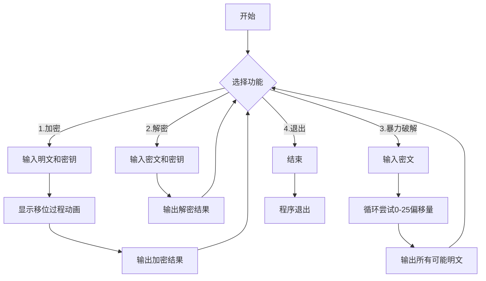
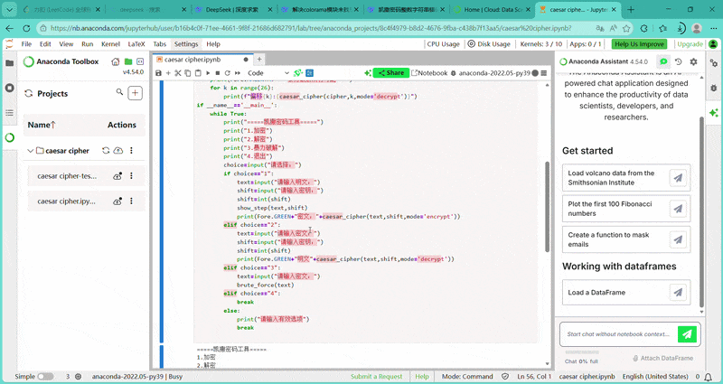
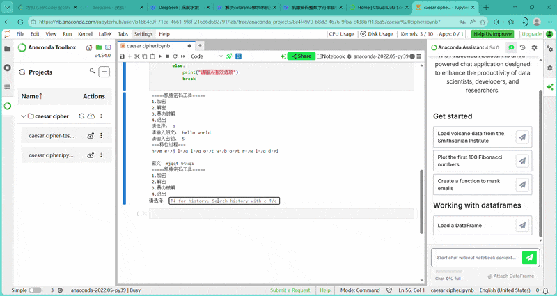
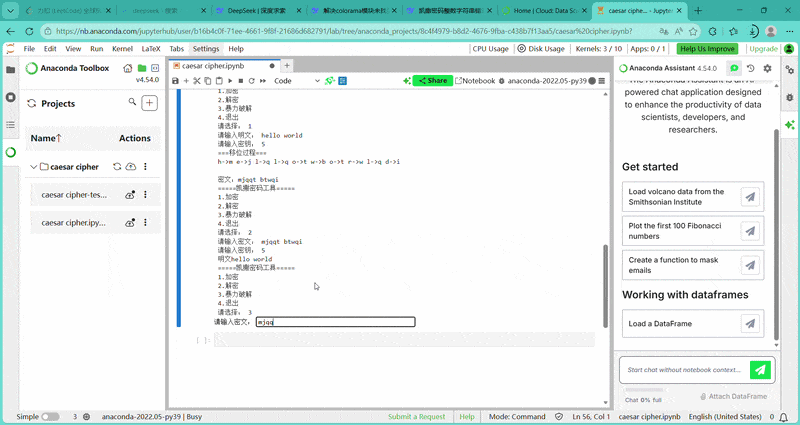

[](https://classroom.github.com/a/fPQK30A4)
# 凯撒密码
本代码旨在实现凯撒密码加密及解密过程，同时提供暴力破解来辅助解密。
- 张琪悦 2243525449
- 王泽宇 2243711404
- 用到的知识：
- 1. Python 基础语法：函数定义与调用（ def  关键字）条件判断（ if/elif/else ）与循环遍历（ for  循环）
                   字符串处理（字符遍历、 isalpha()  判断字母、 chr() / ord()  字符编码转换）输入输出（ input() 、 print() ）与交互式菜单设计
                   模块导入（ from colorama import Fore ）与主程序入口（ if __name__ == "__main__": ）
- 2. 第三方库应用： colorama  库：用于终端彩色输出，通过  Fore.颜色名  实现不同状态信息的色彩标识（如加密结果用绿色、提示信息用青色）
- 3. 算法与逻辑：凯撒密码核心算法：字母位移运算（ (ord(字符) - 基准码 + 位移) % 26 + 基准码 ）
              暴力破解逻辑：遍历 0-25 所有可能位移值，逐一尝试解密并输出结果
              模式区分：通过参数控制加密/解密模式（解密时位移取反）
- 4. 程序设计思想：模块化设计：将加密/解密、步骤展示、暴力破解分别封装为独立函数
                流程控制：通过交互式菜单引导用户选择功能，实现清晰的程序流转
                可视化交互：通过  colorama  和分步打印，让加密/解密过程更直观
## 特点
1. 采用交互式菜单，用户可以选择想要的模式
2. 引入colorama库，将加密过程用色彩标识，更加可视化
3. 提供暴力破解选项，简单还原在不知密钥的情况下的解密
## 流程图

    
## 部署思路
### 环境要求
- Python 3.6+
- colorama库

### 安装步骤
- 克隆或下载代码
```bash
git clone https://github.com/Python-Programming-2026/project1-caesar-cipher-moon.git
cd project1-caesar-cipher-moon
```
- 安装依赖
```bash
pip install colorama
```
- 运行程序
```bash
python caesar-cipher-moon.py
```
## 使用说明
|功能	|描述	|示例|
|:---|:---|:---|
|加密	|输入明文和密钥，显示加密过程	|明文:HELLO, 密钥:3 → KHOOR|
|解密	|输入密文和密钥，还原明文	|密文:KHOOR, 密钥:3 → HELLO|
|暴力破解	|输入密文，尝试所有可能的密钥	|自动显示26种解密结果|

## 目录结构
```text
caesar-cipher-tool/
│
├── caesar_cipher.py    # 主程序文件
├── README.md          # 说明文档
└── requirements.txt   # 依赖包列表
```
## 核心函数
- caesar_cipher(): 凯撒密码加密/解密核心算法
- show_step(): 逐字符显示加密过程（动画效果）
- brute_force(): 暴力破解所有可能的密钥
## 展示动画



